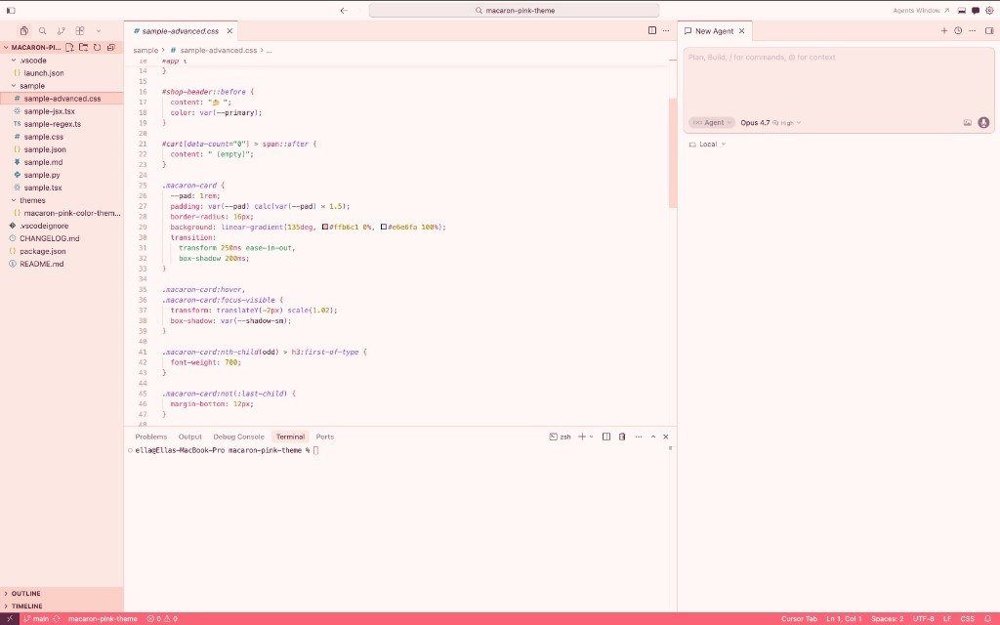
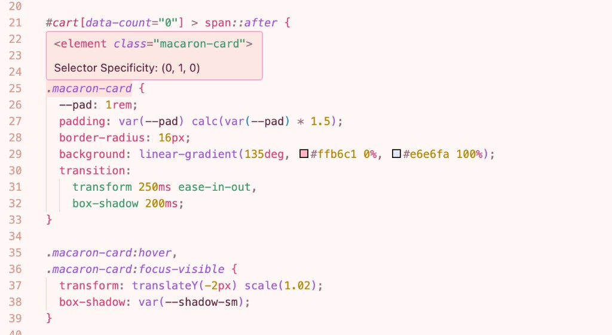
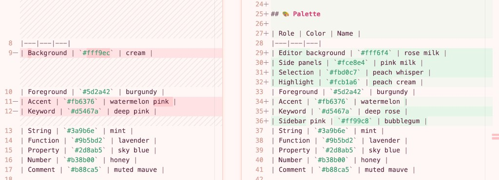

# Pink Lullaby 🍓

> A sweet pastel **light** theme for Cursor / VS Code — soft **rose milk** background with burgundy text, inspired by French macarons.

[](https://marketplace.visualstudio.com/items?itemName=ella-themes.pink-lullaby)
[](https://marketplace.visualstudio.com/items?itemName=ella-themes.pink-lullaby)
[](https://marketplace.visualstudio.com/items?itemName=ella-themes.pink-lullaby)
[](./LICENSE)

---

## ✨ Preview



### Syntax up close



### Palette



---

## 🎨 Palette

| Role | Color | Name |
|---|---|---|
| Editor background | `#fff6f4` | rose milk |
| Side panels | `#fce8e4` | pink milk |
| Selection | `#fbd0c7` | peach whisper |
| Highlight | `#fcb1a6` | peach cream |
| Foreground | `#5d2a42` | burgundy |
| Accent | `#fb6376` | watermelon |
| Keyword | `#d5467a` | deep rose |
| Sidebar pink | `#ff99c8` | bubblegum |
| String | `#3a9b6e` | mint |
| Function | `#9b5bd2` | lavender |
| Property | `#2d8ab5` | sky blue |
| Number | `#b38b00` | honey |
| Comment | `#b88ca5` | muted mauve |

---

## 📦 Install

### From the Marketplace

1. Open Cursor / VS Code
2. `⌘⇧X` → search **"Pink Lullaby"**
3. Click **Install**
4. `⌘⇧P` → `Preferences: Color Theme` → **Pink Lullaby**

### Manual (`.vsix`)

```bash
cursor --install-extension pink-lullaby-0.0.1.vsix
```

---

## 🧁 What's inside

- **Light theme** tuned for long coding sessions (warm but not yellow)
- Covers **100% of VS Code UI surfaces**: editor, sidebar, terminal, panels, diff, peek, notifications, charts
- **Semantic highlighting** enabled with tuned colors for TypeScript / JavaScript / React
- Dedicated rules for **Markdown**, **JSON**, **CSS**, **Python**, **JSX / TSX**, **regex**, **escape chars**, **decorators**
- 16-color **ANSI palette** for the integrated terminal

---

## 💻 Language support

Optimized and tested against:

- TypeScript / JavaScript / TSX / JSX
- Python
- CSS / SCSS
- JSON / JSONC
- Markdown
- HTML

Other languages use the same token scopes and should look great out of the box.

---

## 🛠 Develop locally

1. Clone this repo
2. Open the folder in Cursor
3. Press `F5` to launch an **Extension Development Host** window
4. In the new window: `⌘⇧P` → `Preferences: Color Theme` → **Pink Lullaby**
5. Edit `themes/macaron-pink-color-theme.json` and reload the window (`⌘R`) to see changes

### Sample files

The `sample/` folder contains files that exercise 100% of the token scopes:

- `sample.tsx` / `sample-jsx.tsx` — React components, JSX tags & attributes
- `sample-regex.ts` — regex, escape chars, BigInt, generics, Symbol, enum
- `sample.py` — Python with decorators, dataclasses, async
- `sample.css` / `sample-advanced.css` — CSS with `#id`, `@media`, `@keyframes`, `var()`
- `sample.md` — headings, bold, italic, tables, task lists, code fences
- `sample.json` — nested arrays, `null`, negatives, scientific notation

---

## 💖 Credits

Inspired by the colors of French macarons — rose, lavender, mint, and lemon.

Font pairing that looks great with Pink Lullaby: **Varela Round** + **Nunito Sans**.

---

## 📄 License

[MIT](./LICENSE) © Ella
